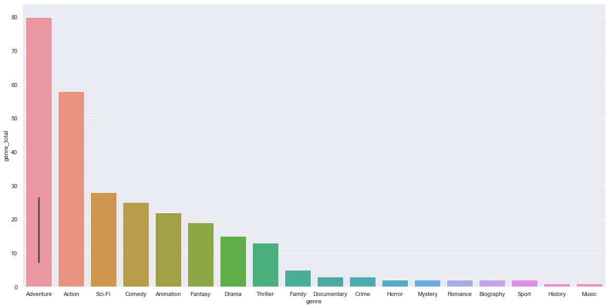

# Theoretical New Microsoft Movie Studio

## Overview

An analysis of data from [IMDB](https://www.imdb.com/) and [Box Office Mojo](https://www.boxofficemojo.com/) indicating features of movies which correlate with higher total gross.  The theoretical scenario for the analysis was Microsoft seeking insight for the creation of a new movie studio.  This analysis could be used, within the theoretical scenario, by Microsoft to target specific factors for the films produced by its new studio which would increase the likelihood of a higher total gross.


## Business Problem

Microsoft sees all the big companies creating original video content and they want to get in on the fun. They have decided to create a new movie studio, but they don’t know anything about creating movies. You are charged with exploring what types of films are currently doing the best at the box office. You must then translate those findings into actionable insights that the head of Microsoft's new movie studio can use to help decide what type of films to create.
***

## Data

### [IMDB](https://www.imdb.com/)

An online database of information related to films, television programs, home videos, video games, and streaming content.

Data downloaded from [IMDB](https://www.imdb.com/) was:
* **Genre** - Which types of movies tend toward higher total gross revenues?


* **Average Rating** - Does the rating of a movie by fans correlate with higher total gross revenue?
(number of votes was also accounted for in order to identify potential outliers which may have a comparatively small quantity of passionate voters, potentially positive or negative, which is not representative of the larger population of people who saw the movie)


### [Box Office Mojo](https://www.boxofficemojo.com/)

A website owned by IMDB which tracks box office revenue of films.

Data downloaded from [Box Office Mojo](https://www.boxofficemojo.com/) was the domestic gross revenue and foreign gross revenue of movies released between 2010 and 2018.  A total gross revenue derived from the sum of the domestic gross revenue and foreign gross revenue as the metric against which individual variables were compared.

* **Foreign Gross Ratio** - Does the ratio of the foreign gross revenue correlate with higher total gross revenue?
***

## Methods

In order to draw direct comparisons between the questioned variables and total gross the following steps were taken:
* Matching the release year range of the [Box Office Mojo](https://www.boxofficemojo.com/) Data and [IMDB](https://www.imdb.com/) Data.
* Creating a total gross revenue, the sum of domestic gross revenue and foreign gross revenue, for each movie.
* Remove extraneous information from various datasets not associated with identified variables.
* Combined the various datasets into a single dataframe from which all of the identified variables associated with each movie can be compared directly with its total gross revenue.
***

## Results

### Foreign Gross Ratio

The movies with the highest total gross revenues converge between 55-60% foreign gross revenue ratio.

The mean foreign gross revenue increases as a narrower subset highest total gross revenues is assessed.  
* Of the 100 movies with the highest total grossing movies the foreign gross reveniue ratio mean is %54.27 
* Of the 100 movies with the highest total grossing movies the foreign gross reveniue ratio mean is %57.68 
* Of the 100 movies with the highest total grossing movies the foreign gross reveniue ratio mean is %62.08 

This indicates a correlation between the ratio of a movie's total gross revenue generated internationally and an increased the likelihood of a higher total gross.

This highlights the importance of a movie's ability to perform in foreign markets toward its ability to be financially successful.

Here is an example of how to embed images from your sub-folder:

### Foreign Gross Ratio Visual


### Average Rating

The movies with the highest total gross revenues converge approximately around a mean average rating of 5.5, which is below the mean average rating for all movies within the sample, which is approximately 5.9.

This indicates that while the movies with the highest total gross revenue do typically maintain an average rating close to the mean, a movies average rating does not correlate with an increased likelihood of a higher total gross.

A movie does not have to be rated highly in order to be financially successful.

### Average Rating Visual


### Genre

The movies with the highest total gross revenues largely have genres of Adventure, Action, Sci-Fi, Comedy, and Animation.

This indicates a strong correlation between the genre of a movie and an increased likelihood of a higher total gross.

Each of the movies within the sample includes up to three genres, many of the highest total gross revenues have multiple of the highest grossing genres (for example, many movies which include the genre adventure also include action).

This highlights the importance of the type of movie (and combination of types) in its ability to be financially successful.

### Genre Visual



## Conclusions

Within the theoretical scenario of Microsoft seeking insight for the creation of a new movie studio, this analysis leads to three recommendations toward helping decide what type of movies to make for an increased likelihood of a higher total gross:
* **Make Movies within the Most Successful Genres** - The highest grossing movies largely have genres of Adventure, Action, Sci-Fi, Comedy, and Animation.  Many combine multiple of the highest grossing genres.


* **Focus on Foreign Markets** - The highest grossing movies tend to receive over half of their total gross from their foreign gross revenue.


* **Deemphasize Ratings** - The highest grossing movies tend to receive average ratings similar to or even below the mean.
***

## More Information

[Jupyter Notebook](./theoretical_new_microsoft_movie_studio_notebook.ipynb)
[Presentation](./Theoretical New Microsoft Movie Studio.pdf)

### Wes Swager
[Email] (mail.westin.swager@lsventures.com)
[GitHub](https://github.com/wswager)
[LinkedIn](linkedin.com/in/wes-swager-36a84a2a)

## Repository Structure

```
├── README.md
├── theoretical_new_microsoft_movie_studio_notebook.ipynb
├── Theoretical New Microsoft Movie Studio.pdf
├── data
└── images
```
